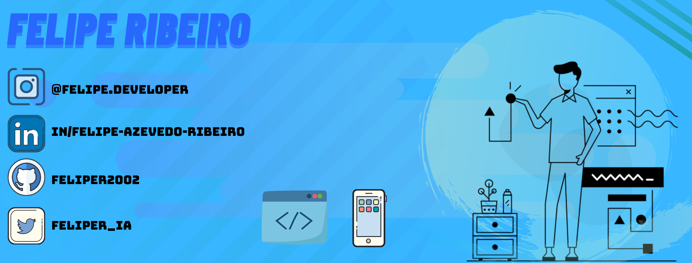

<table>
    <tr>
        <td></td>
        <td></td>
    </tr>   
</table>

- 📱 Estudando Desenvolvimento Mobile com Flutter desde outubro de 2020
- 🌐 Inglês técnico e intermediário
- ☕ Estudando Dart
- 📚 Estudante de Engenharia de Computação no CENTRO UNIVERSITÁRIO SENAI CIMATEC
- ⚡ Amante do basquete 🏀

#### Línguagens

   

#### Tecnologias, Frameworks e Plataformas

      

#### >>> Stacks principais <<<

#### Portfólio - Site

[Portfólio Dev](https://github.com/feliper2002/felipe.developer) 

[Link do site](https://feliper.dev/)
