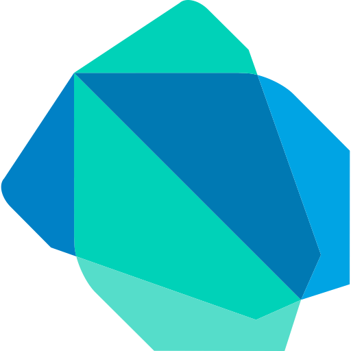
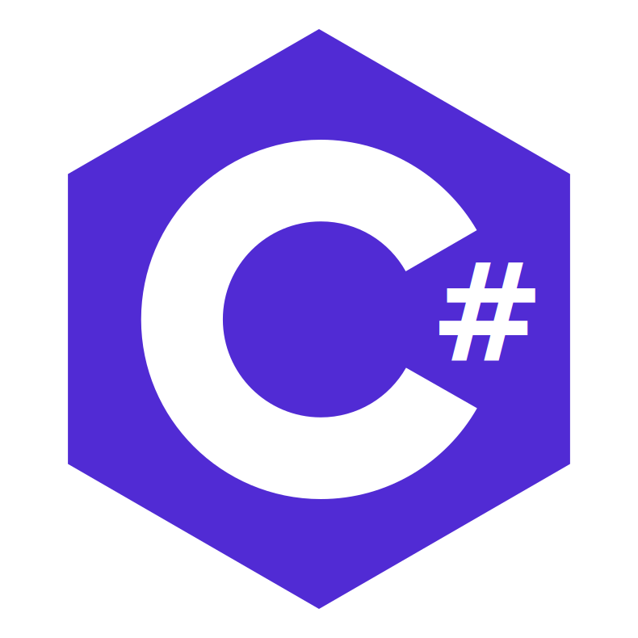
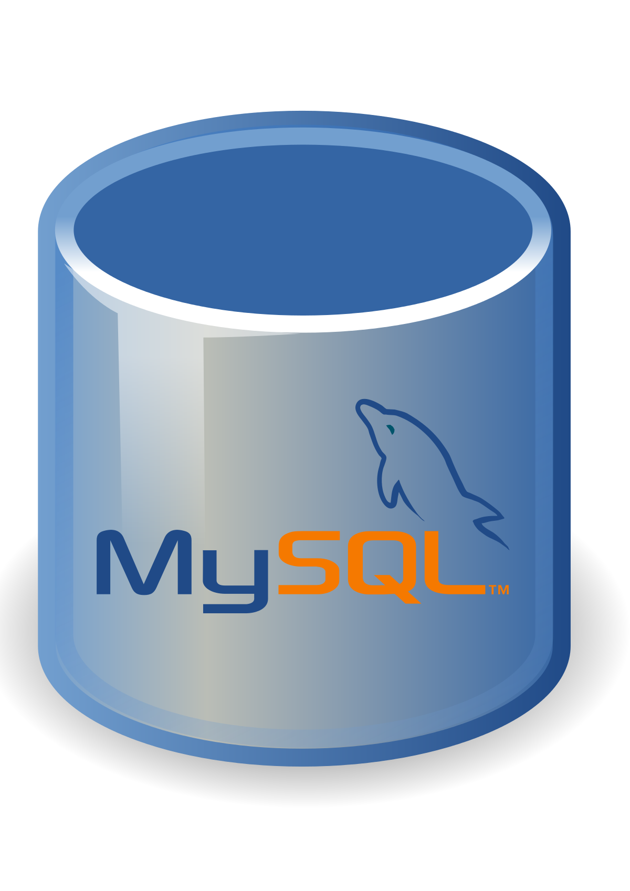

Hey! I'm Felipe, a 24-year-old Full-Stack Developer passionate about technology, science, AI, calculus, the geek universe, and everything that involves creativity.

I turn ideas into products, whether that means crafting pixel-perfect mobile experiences, building robust APIs, or wiring up the infrastructure that keeps it all running. My toolkit spans from frontend to backend, from databases to DevOps, and I'm always picking up new tools along the way.

I share what I learn by writing articles and contributing to the tech community whenever I can.

Building in public: [Follow me on Threads](https://www.threads.com/@feliper.tech)

---

### **About me**

- 📌 Salvador - Bahia, Brazil
- 🌴 Anime, geek culture, games 👾, coffee ☕, reading 📚, and drawing 🎨 are part of my daily life
- 💚 Hardcore Pokémon fan
- 🏃🏻‍♂️ Amateur runner and swimmer in my spare time

---

### **Tech Curiosities**

- 🌱 Currently in a Full-Stack Software Developer role
- 📫 Contact: feliper.dev@gmail.com
- 📝 Articles and tutorials on [dev.to](https://dev.to/feliperfdev)
- 📖 Currently reading: **The Pragmatic Programmer - Andrew Hunt**

---

<h3><b>💻 Technologies, Frameworks, and Tools</b></h3>

<b>Core technologies</b>

     

<b>Backend & Databases</b>

       

<b>Devops & Infrastructure</b>

 
 

<b>Cloud</b>

 
 

---

#### **💙 Featured Projects**

- [NullBattle]([https://github.com/feliperfdev/PokemonTrainersAPI-ASP.NET](https://github.com/feliperfdev/NullBatlle))
  - A turn-based Pokémon battle engine written in C++17, faithfully replicating Generation 3 mechanics — damage formula, type effectiveness, speed/priority ordering, and status conditions.

- [Pokémon API](https://github.com/feliperfdev/PokemonTrainersAPI-ASP.NET)
  - A ASP.NET API which I developed creating a "Trainer-Pokémon" organization system by team parties and PC-Box (Pokémon core game systems).
  - The project is fully "backended", so it's a ASP.NET API integrated to a PostgreSQL database without any frontend. 

- [Wander Level](https://www.threads.com/@feliper.tech/post/DTS_R-ckWtB?xmt=AQF0H7e8doDmwnBewqo3sGzInWYm9NKoPsUngEu9vXq9wA)
  - A Micro-SaaS mobile app I'm developing at the moment to gamify vacations tracking.
  - Mobile app being developed with **Flutter**, backend serverless with **Supabase**. Applying offline-first strategies with sync-queue, managing local data with **Drift ORM**.

- [FinanceTracker](https://www.linkedin.com/posts/feliperdev_flutter-typescript-programacao-activity-7374443945122246656-Fj_W/?utm_source=share&utm_medium=member_desktop&rcm=ACoAAC5Uu1QBLhANm2nfwIcgz4gq2G62VzhFMO4)
  - A SideProject mobile app I've developed to manage personal finances.
  - Mobile app being developed with **Flutter**, backend with **AWS DynamoDB** as database, **AWS Lambda Functions** to serverless function calling, **AWS API Gateway** to API deploy and management and **AWS Cognito** to authentication.

- [Aibum](https://www.aibum.app/)
  - A Micro-SaaS to generate beautiful images to coloring by sending pictures from your own gallery .
  - Flutter web app built with **Flutter**, APIs with **Supabase** and **Express.js**.

- [KeepLinked](https://www.keeplinks.in/)
  - My first Micro-SaaS: organize all your links in custom folders, with tags and privacy. Save, find, and access everything important to you, from anywhere, anytime. Simple, secure, and your way.
  - Mobile app built with **Flutter**, APIs with **Supabase** and **Express.js**, browser extension with **React + Vite.js**.

- [AbacatePay Dart/Flutter SDK](https://pub.dev/packages/abacatepay)
  - SDK for integrating [AbacatePay](https://www.abacatepay.com/) in Flutter/Dart apps.

- [Flutter4Noobs](https://github.com/feliperfdev/flutter4noobs/)
- [Minecraft Plugins](https://github.com/feliperfdev-MC-Plugins)
  - Plugins for Bukkit/Spigot using Kotlin, MySQL integration via **Dart Shelf**, and requests with **Kotlin Retrofit**.

---

    
🏆 Achievements and stats

    
    

    

