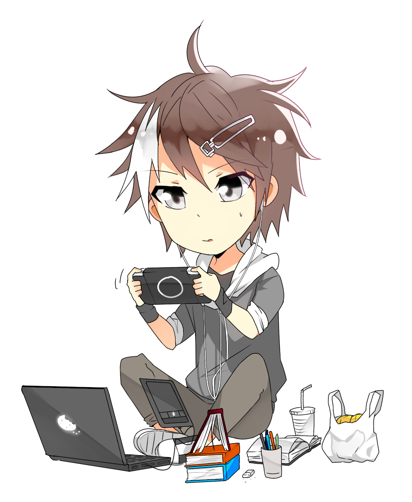

## **${Hello.dev}** **👋**

    <h3> <b> 🌠Contact-me! </b> </h3> 

    
    

    <tr>
        <td></td>
    </tr>   

☕📱 Ask me about [**Dart**](https://dart.dev) and [**Flutter**](https://flutter.dev) 

📌 Living in Salvador Bahia, Brazil 

💜🌴 Love anime, basketball, reading 📚 and drawing 🎨

    
 📱👩🏻‍💻 I'm currently working as a Flutter developer at F-Team

#### 💻 **Languages**, **Technologies**, **Frameworks** e **Platforms**

        

 

#### **🌍 Follow me at**

    
#### **🏆 GitHub Profile Trophy (@feliper2002):**

